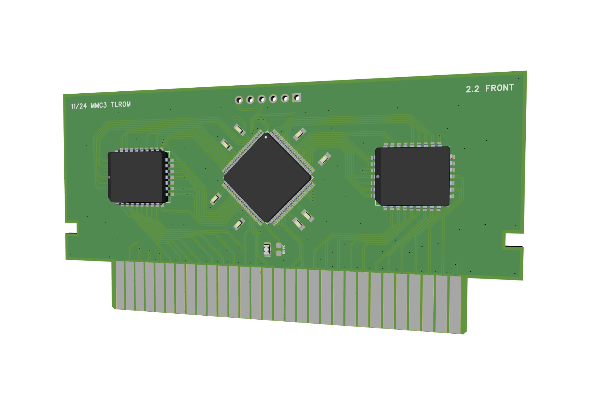
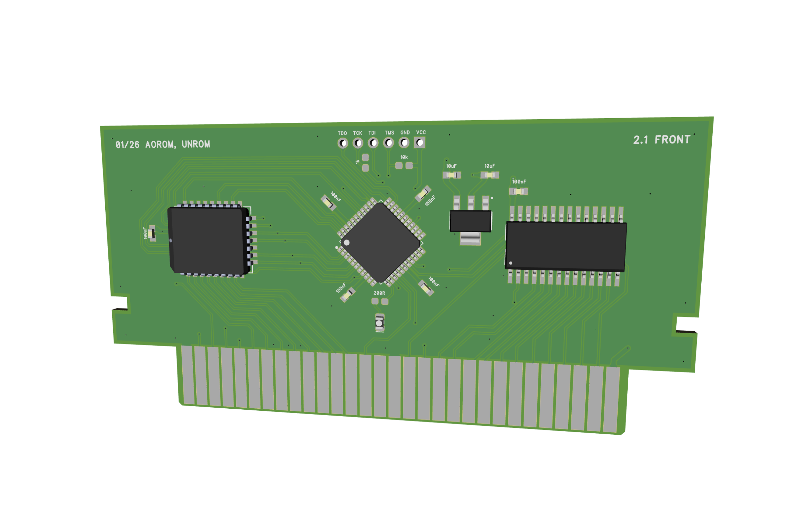

# UNROM v2 Cartridge PCB

NES UNROM cartridge board design (v2).

## Board Layout

## Files

- [unromv2.dch](unrom-aorom/v2/unromv2.dch) - Schematic
- [unromv2.dip](unrom-aorom/v2/unromv2.dip) - PCB layout
- [unromv2_gerber.zip](unrom-aorom/v2/unromv2_gerber.zip) - Gerber files for manufacturing
